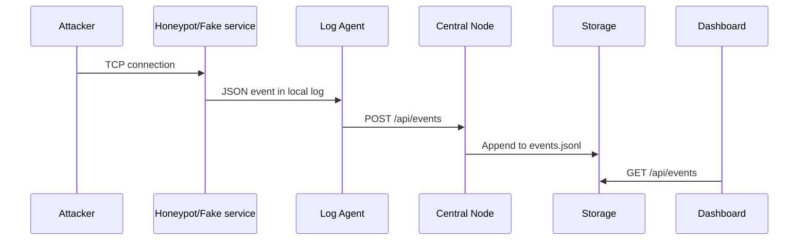

# Architecture

Проект строится как распределенный комплекс раннего выявления подозрительной сетевой активности.

## Компоненты

- `sensor1` - сенсор DMZ, профиль `opencanary`.
- `sensor2` - внутренний офисный сенсор, профиль `cowrie`.
- `sensor3` - OT/mining-сенсор, профиль `conpot`.
- `central-node` - прием, хранение и просмотр событий.
- `log-agent` - доставка событий с сенсора в центр.
- `display-agent` - локальный статус сенсора.
- `fake-services` - встроенный тестовый honeypot, который позволяет проверить стенд до подключения реальных honeypot-контейнеров.

## Поток события

## Обоснование

Сенсоры остаются легкими: они принимают подключения, пишут локальные события и отправляют их в центр. Центральный узел берет на себя хранение и просмотр, поэтому на Banana Pi Pro не нужно держать тяжелую аналитику.
