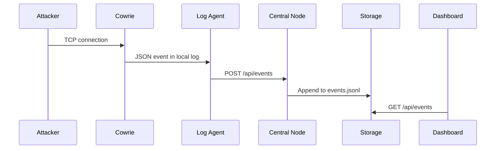

# Architecture

Проект строится как распределенный комплекс раннего выявления подозрительной сетевой активности.

## Компоненты

- `center/collector` - прием, хранение и просмотр событий.
- `center/manager` - web-консоль управления, генерации конфигураций и SSH-деплоя сенсоров.
- `center/ansible` - установка или обновление сенсорной платы с центрального узла.
- `sensor` - плата или VM с Cowrie и агентами доставки событий.
- `log-agent` - доставка событий с сенсора в центр.
- `display-agent` - локальный статус сенсора.
- `cowrie` - настоящий open-source SSH/Telnet honeypot на сенсоре.

## Поток события

## Обоснование

Сенсоры остаются легкими: они принимают подключения, пишут локальные события и отправляют их в центр. Центральный узел берет на себя хранение и просмотр, поэтому на Banana Pi Pro не нужно держать тяжелую аналитику.
